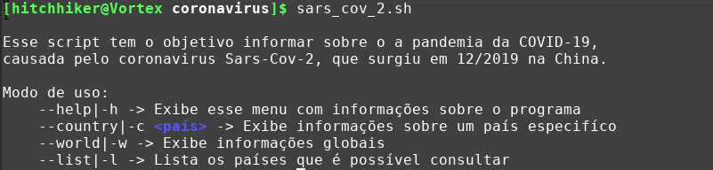
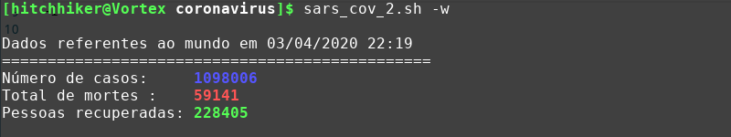
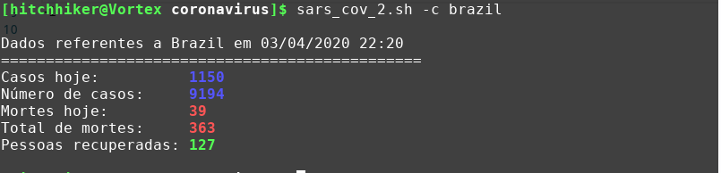

# Dados mundiais sobre o COVID-19 no terminal

Script baseado no [artigo](https://meleu.sh/coronavirus/) do meleu.

Está versão contém pequenas alterações,
e foi criado para estudar shell script, com foco a acessos a APIs e manipulações de JSON.

Como usar
=========

O script oferece de consultar informações dos casos confirmados, mortes, e pessoas recuperadas. é possível consultar sobre o mundo inteiro, um país especifico e as listas de países que é possível pesquisar.

Exemplo de uso
---------------

Menu de ajuda do scritp:

Informações globais:

Informaçõe sobre um país especifíco:
